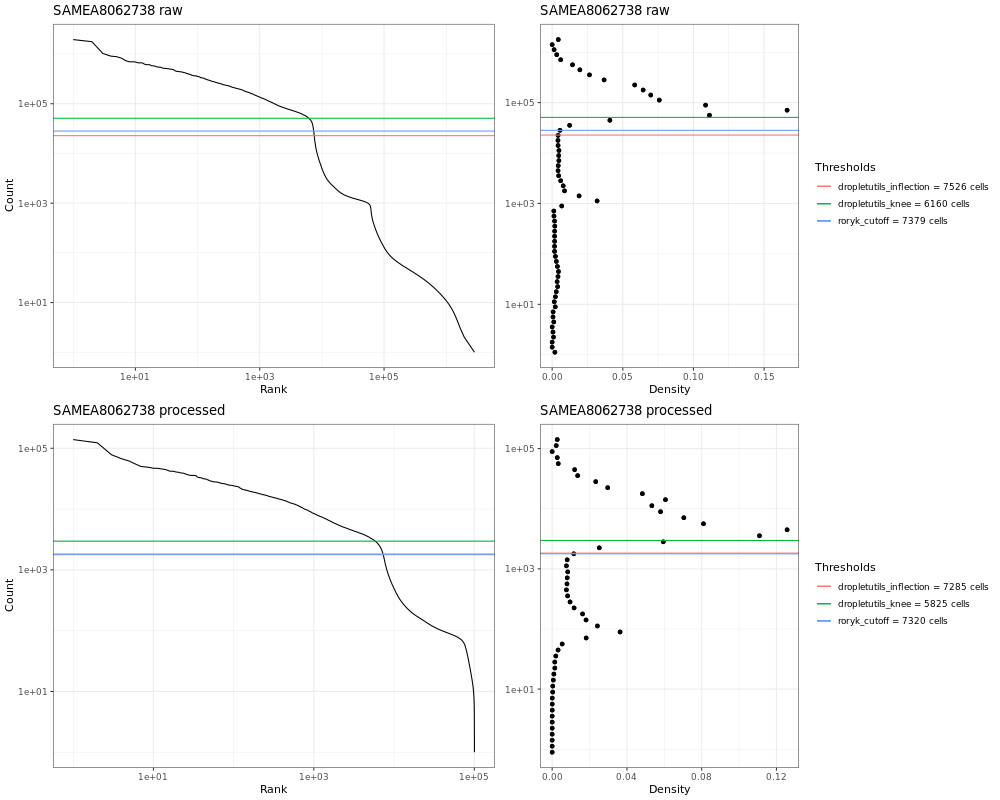

# Single Cell Expression Atlas droplet quantification workflow

This is the Nextflow-based quantification component for used for droplet-based studies in Single Cell Expression Atlas. It's basically just calling Alevin, with some logic for sample handling.

For anyone starting out with droplet RNA-seq analysis, especially using Alevin, we highly recommend [this tutorial](https://training.galaxyproject.org/training-material/topics/transcriptomics/tutorials/droplet-quantification-preprocessing/tutorial.html), which covers a workflow similar to the one used here.

## Summary of steps

The workflow does the following:

 - Downloads fastq files from specified URIs using our [FASTQ provider](https://github.com/ebi-gene-expression-group/atlas-fastq-provider). The FASTQ provider does some special things for EBI users, but will just wget specified files by default.
 - Interprets provided sample and configurations to determine the correct arguments for Alevin, combining technical replicate groups where appropriate for analysis.
 - Runs [Alevin-fry]([https://salmon.readthedocs.io/en/latest/alevin.html](https://alevin-fry.readthedocs.io/en/latest/))
 - Makes a droplet barcode plot for each library
 - Runs [emptyDrops](https://genomebiology.biomedcentral.com/articles/10.1186/s13059-019-1662-y) to remove remove droplets clearly without cells. 

## Inputs

The workflow requires as input:

 - A pre-prepared [Salmon splici-index]([https://salmon.readthedocs.io/en/latest/salmon.html#preparing-transcriptome-indices-mapping-based-mode](https://combine-lab.github.io/alevin-fry-tutorials/2021/improving-txome-specificity/))
 - A three-collumn transcript-to-gene mapping file used by Alevin to summarise quantifications to the gene level, is produced when building the splici trasncriptome 
 - A tabular samples file (SDRF) containing information about the libraries to be quantified
 - A Nextflow configuration file describing the data in the tabular samples table
 - An output directory for results

### Transcript to gene map

This is simply a tab-delmited file with transcript and gene identifiers, like:

```
FBti0019092-RA	FBti0019092	S
FBti0019093-RA	FBti0019093	S
FBti0019100-RA	FBti0019100	S
FBti0019102-RA	FBti0019102	S
FBti0019104-RA	FBti0019104	S
FBti0019106-RA	FBti0019106	S
FBti0019111-RA	FBti0019111	S
FBti0019113-RA	FBti0019113	S
FBti0019115-RA	FBti0019115	S
FBti0019116-RA	FBti0019116	S
...
```

__Note__: it's important that this map contains a gene for every transcript in your reference.


### Tabular samples file

Here's an example of a real tabular input to the the workflow.

```
Comment[ENA_RUN]	Comment[LIBRARY_LAYOUT]	Comment[technical replicate group]	Comment[LIBRARY_STRAND]	cdna_uri	cell_barcode_uri	umi_barcode_uri	Comment[cDNA read offset]	Comment[cell barcode offset]	Comment[umi barcode offset]	Comment[cDNA read size]	Comment[cell barcode size]	Comment[umi barcode size]	end	Comment[cell count]
SRR6327113	SINGLE	SAMN08105407	first strand	sra/ftp://ftp.sra.ebi.ac.uk/vol1/srr/SRR632/003/SRR6327113/SRR6327113.fastq.gz/SRR6327113_2.fastq.gz	sra/ftp://ftp.sra.ebi.ac.uk/vol1/srr/SRR632/003/SRR6327113/SRR6327113.fastq.gz/SRR6327113_1.fastq.gz	sra/ftp://ftp.sra.ebi.ac.uk/vol1/srr/SRR632/003/SRR6327113/SRR6327113.fastq.gz/SRR6327113_1.fastq.gz	16	46	16	10	5	3158
SRR6327115	SINGLE	SAMN08105406	first strand	sra/ftp://ftp.sra.ebi.ac.uk/vol1/srr/SRR632/005/SRR6327115/SRR6327115.fastq.gz/SRR6327115_2.fastq.gz	sra/ftp://ftp.sra.ebi.ac.uk/vol1/srr/SRR632/005/SRR6327115/SRR6327115.fastq.gz/SRR6327115_1.fastq.gz	sra/ftp://ftp.sra.ebi.ac.uk/vol1/srr/SRR632/005/SRR6327115/SRR6327115.fastq.gz/SRR6327115_1.fastq.gz	16	55	16	10	5	1418
SRR6327103	SINGLE	SAMN08105415	first strand	sra/ftp://ftp.sra.ebi.ac.uk/vol1/srr/SRR632/003/SRR6327103/SRR6327103.fastq.gz/SRR6327103_2.fastq.gz	sra/ftp://ftp.sra.ebi.ac.uk/vol1/srr/SRR632/003/SRR6327103/SRR6327103.fastq.gz/SRR6327103_1.fastq.gz	sra/ftp://ftp.sra.ebi.ac.uk/vol1/srr/SRR632/003/SRR6327103/SRR6327103.fastq.gz/SRR6327103_1.fastq.gz	16	55	16	10	5	1661
SRR6327117	SINGLE	SAMN08105405	first strand	sra/ftp://ftp.sra.ebi.ac.uk/vol1/srr/SRR632/007/SRR6327117/SRR6327117.fastq.gz/SRR6327117_2.fastq.gz	sra/ftp://ftp.sra.ebi.ac.uk/vol1/srr/SRR632/007/SRR6327117/SRR6327117.fastq.gz/SRR6327117_1.fastq.gz	sra/ftp://ftp.sra.ebi.ac.uk/vol1/srr/SRR632/007/SRR6327117/SRR6327117.fastq.gz/SRR6327117_1.fastq.gz	16	86	16	10	5	4328
...
```

The links you see here have a special format here which tells the FASTQ provider to download an unpack SRA files for those libraries, but yours will likely be simple URIs pointing directly to FASTQ files. 

The meaning of the fields is covered in more detail below.

### Parameters file

```
params{
    protocol = '10xv2'

    fields {
        run = 'Comment[ENA_RUN]'
        layout = 'Comment[LIBRARY_LAYOUT]'
        techrep = 'Comment[technical replicate group]'
        cdna_uri = 'cdna_uri'
        cell_barcode_uri = 'cell_barcode_uri'
        umi_barcode_uri = 'umi_barcode_uri'
        cdna_read_offset = 'Comment[cDNA read offset]'
        cell_barcode_offset = 'Comment[cell barcode offset]'
        umi_barcode_offset = 'Comment[umi barcode offset]'
        cdna_read_size = 'Comment[cDNA read size]'
        cell_barcode_size = 'Comment[cell barcode size]'
        umi_barcode_size = 'Comment[umi barcode size]'
        end = 'end'
        cell_count = 'Comment[cell count]'
    }
}
```

This configuration refers to the fields in the samples table and describes how they should be used to control how Alevin is run.

In this example the libraries are 10X v2, which means they have a 16bp cell barcode and 10bp unique molecular identifier (UMI). The barcode configuration is illustrated in the samples file above, but you should change the configuration dependent on your libraries, for example 10Xv3 libraries have 12bp UMIs. 

The allowable protocol names are [here](https://github.com/ebi-gene-expression-group/scxa-droplet-quantification-workflow/blob/b99ebd9192c2c6f690b0563a7a36eede7d8f401e/nextflow.config#L39). Take special care to use the 5prime library time if necesary for the newer 10X 5-prime libraries, since if you fail to do so your mapping rate will be extremely low.

## Running the workflow

The workflow uses Conda to provide software dependencies for individual workflow steps. You must also have Nextflow itself installed. With those prerequisites in place the workflow is run like:

```
nextflow run \
    -config CONF_FILE \
    --sdrf SAMPLES_FILE \
    --protocol PROTOCOL \
    --resultsRoot OUTPUT_DIR \
    --transcriptToGene TRANSCRIPT_TO_GENE \
    --transcriptomeIndex TRANSCRIPTOME_INDEX \
    -resume \
    main.nf \
```

## Outputs

### OUTPUT_DIR/alevin/SAMPLE: basic Alevin outputs

If the workflow runs successfully you will see a folder for every sample under 'alevin' at your specified output directory. See the [Alevin docs](https://salmon.readthedocs.io/en/latest/alevin.html#output) for more info on this output.

### OUTPUT_DIR/alevin/SAMPLE/alevin/mtx/counts_mtx

This directory is a copy of the raw Alevin output converted to a more useful 10X-style MTX that can be read by many tools (Scanpy, dropletUtils etc).

### OUTPUT_DIR/alevin/SAMPLE/alevin/mtx/counts_mtx_nonempty

This is the same as above, but with emptyDrops() applied to remove empty droplets.

### OUTPUT_DIR/alevin/SAMPLE/alevin/qc

This folder contains a QC plot like this one:



This shows a barcode plot for the library and illustrates the impact of running emptyDrops(). 

This plot should show a clear steep-as-possible dropoff between populated and unpopulated droplets. 

In this example you should be able to see a population of droplets to the right of the top plot that are absent in the bottom one, removed by emptyDrops(). Note that we have not simply applied one of the thresholds illustrated in the figure, since this can lead to issues with removal of certain genuine cell populations. See the [emptyDrops paper](https://genomebiology.biomedcentral.com/articles/10.1186/s13059-019-1662-y) to understand what that tool actually does. We would also again point you at [this tutorial](https://training.galaxyproject.org/training-material/topics/transcriptomics/tutorials/droplet-quantification-preprocessing/tutorial.html) for more in-depth coverage of this.

## Next steps

With these results in hand we do the following (you may want to do similarly)

 1. [Aggregate the matrices from different libraries](https://github.com/ebi-gene-expression-group/scxa-aggregation-workflow)
 2. [Do downstream analysis in Scanpy](https://github.com/ebi-gene-expression-group/scxa-workflows)
